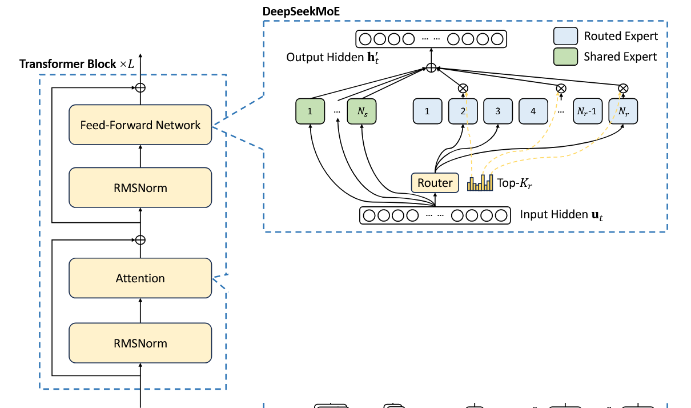

# NJUProject_MoE_Offloading

# 课程大作业：MoE Offloading

## 一、任务说明

## 1.1 背景

随着深度学习模型的规模不断增加，模型的计算需求也随之变得更加庞大。为了优化计算性能并降低显存消耗，混合专家模型(Mixture of Experts, MoE)已成为一个重要的研究方向。它通过将模型划分为多个专家(expert)并动态路由输入token到特定专家，能够在保持计算量相对恒定的情况下大幅增加模型参数量。DeepSeek-V2-Lite-Chat就是这样一个MoE模型，其大部分参数集中在expert中。

然而，MoE模型通常参数量非常大，难以在单张GPU卡上完整加载和运行。本项目旨在通过offloading技术，在有限显存的单卡环境下成功运行DeepSeek-V2-Lite-Chat模型。

## 1.2 Offloading推理系统

Offloading推理系统是一种将模型**部分参数或计算**临时从GPU显存卸载到主机内存或存储设备的技术，当需要时才动态加载回显存。

对于MoE模型，由于每个输入token通常只激活少量专家，我们可以利用这一稀疏特性，只将当前需要的专家加载到显存中，其他专家暂时卸载到主机内存，从而大幅减少显存占用。

## 1.3 DeepSeek-V2-Lite-Chat模型

DeepSeek-V2-Lite-Chat模型的资料如下。一共27层，每层有64个专家，一个token激活6个专家，有2个shared专家。

[deepseek-ai/DeepSeek-V2: DeepSeek-V2: A Strong, Economical, and Efficient Mixture-of-Experts Language Model](https://github.com/deepseek-ai/DeepSeek-V2)

[deepseek-ai/DeepSeek-V2-Lite-Chat · Hugging Face](https://huggingface.co/deepseek-ai/DeepSeek-V2-Lite-Chat)

# 二、方法设计规范

## 2.1 系统实现（必选）

你需要实现DeepSeek-V2-Lite-Chat模型在单卡上的推理。在这一部分只实现expert参数的卸载。

* Epxert参数存放在CPU内存中，其他参数（shared expert、attention....）放在GPU显存中。
* 计算在GPU上进行，当目前layer需要使用expert时，将expert加载到GPU中进行计算。

## 2.2 优化（至少完成第一个）

首先要完成“专家缓存”，在完成后，可以进行“专家激活预测与预取”和“专家计算卸载”的优化。

1. **专家缓存**

   * GPU显存如果有额外空间，可以缓存一部分expert在GPU中，称为专家缓存，避免需要时再耗费时间加载。（例如缓存那些最常被激活的expert）

   * 可以探索专家缓存策略：当加载新的专家进GPU时，需要驱逐专家缓存中的专家，例如用LRU、LFU等策略进行专家驱逐。

2. **专家激活预测与预取**
   * 可以通过一些技巧预测下一层激活的专家，然后提前将这些专家加载到GPU中，避免需要时再耗费时间加载。
     1. 训练一个模型（例如简单的MLP）进行专家激活的预测，在layer i时预测layer i+k的专家激活
     2. 在layer i，可以直接使用layer i+1的gate进行layer i+1的专家激活预测

3. **专家计算卸载**
   * 当所需专家不在专家缓存中时，直接将中间激活值传到CPU上，在CPU上进行expert计算（因为传输expert非常耗时，不如在CPU中进行计算）

> 参考资料:
>
> * [ICLR'25] Fast Inference of MoE Models with CPU-GPU Orchestration
>   * [efeslab/fiddler: [ICLR'25\] Fast Inference of MoE Models with CPU-GPU Orchestration](https://github.com/efeslab/fiddler)
> * Fast Inference of Mixture-of-Experts Language Models with Offloading
>   * [dvmazur/mixtral-offloading: Run Mixtral-8x7B models in Colab or consumer desktops](https://github.com/dvmazur/mixtral-offloading/tree/master)

# 三、实验要求

## 3.1 评估指标

* latency：每个输出token间隔
* throughput：tokens per second

## 3.2 需要做的实验

自己选定数据集。

在不同配置下测量性能：

1. Batch Size：1, 4, 8, 16
2. Sequence Length：128, 256, 512

# 四、提交内容

1. **代码**

   * 代码结构不做要求
   * 要给出能够运行的python环境（requirement.txt）
   * 要给出能成功运行代码的脚本

2. **报告**

   * 实现方法：详细描述系统架构和实现方法

   - 优化方法：说明采用的优化策略及其实现方法
   - 实验结果：展示不同配置下的延迟和吞吐量数据，并对结果进行分析

# 五、注意事项

**参考文献：** 如果你在实验和报告中参考了已发表的文献，请列出你所参考的相关文献。

**截止日期：** 2025年6月20日 23:59（UTC+8）。

如有疑问，请联系 wzbwangzhibin@gmail.com 或 zzhbrr@gmail.com。
